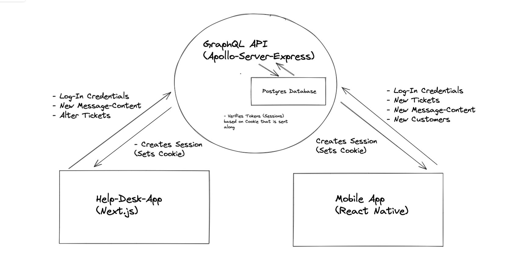

# BlueJay

 

### Final Project for UpLeveled Bootcamp, Vienna

 
A full-scale customer-support-system for the fictional airline "BlueJay". Customers can use the mobile app to get in touch with customer support; airline staff can log-in to the help-desk web-app and interact with tickets issued by customers.

 

- Help-Desk-App (Next.js):  
  https://bluejay-helpdesk.herokuapp.com/
- Mobile-App (React Native with Expo):
  https://expo.dev/@lorenz-arthur/bluejay-premium-app
- API (GraphQL, Apollo-Server-Express):  
  https://bluejay-api.herokuapp.com/graphql

 

### Go to

[Gallery](#gallery)
 
[Try it out yourself](#try-it-out-yourself)
 
[Functionalities](#functionalities)
 
[Technologies](#technologies)

 

### Gallery

 

- Help-Desk-App

 

 

 

 

 

- Mobile App

 

 

- Data-Base Schema - drawSQL

 

 

- Wire-Frames (example) - Figma

 

 

- Functionality-Map - Miro

 

 

- System Architecture - Excalidraw

 

 

### Try it out yourself

 

- Open the Help-Desk-App (server may take some time to load) as well as the API (in order to "wake up" the API server)
  - Log-in using Employee ID _"00001"_ and Password _"JenniferTestPassword1"_
  - You are now logged-in as Jennifer with admin-rights
  - See tickets, click on any to write responses, close them, delete them, assign them to team members or change their priority status
  - Try out the various filter-methods in the sidebar or above
  - Click on the pie-chart icon on the left to inspect ticket report data, change the time window with the calendar functionality
  - Log out and log-in again, using Employee ID _"00002"_ and Password _"JohnTestPassword1"_
  - You are now logged in as John without admin-rights
  - See only tickets assigned to John, missing the admin functionalities
- Register at EXPO and download the Expo mobile app to your phone
  - Create a new user by following the link beneath the log-in
  - Log-in with your created e-mail and password
  - Press _Contact_, then _Messages_
  - Create a new message and press send
  - You can now go back to the help-desk-app (see instructions above) and inspect the newly created ticket, send a response there and re-inspect that response in the Expo app.
     
     

### Functionalities:

 

- Help-Desk Web-App

  - Cookie-based employee-authentication (login)
  - Authorization (admin-rights)
  - Inspect tickets
  - Filter tickets (status, category,urgency, unassigned, etc.)
  - Admin: Assign individual tickets or change urgency
  - Close, delete, reopen tickets
  - Admin: Ticket-Report-Page: inspect information about all issued tickets in a given time-period (that can be adjusted)

   

- Mobile App
  - Cookie-based customer-authentication (login / register)
  - Send a new message (create a ticket)
  - Choose a category for the new ticket and a title
  - Respond within the opened ticket
  - Notification on the option "Contact", indicating that the customer has an unresponded message from the airline staff

 

### Technologies

 

- Help-Desk Web-App
  - Typescript
  - Next.js
  - Emotion (CSS-in-JS)
  - Jest (unit-testing)
  - Cypress (e2e-testing)

 

- Mobile App
  - React-Native
  - Developed with Expo

 

- API
  - GraphQL
  - Apollo-Server
  - Express
  - Node.js
  - PostgreSQL

 

- Using Yarn Workspaces (Monorepo)
